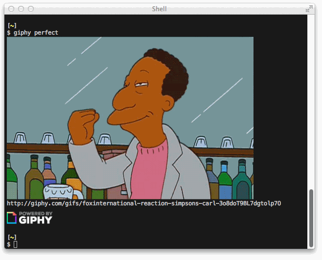

Have you ever though **Oh man, Giphy is great, but I wish I could use it in my terminal**?
Well now you can! (Assuming you're an iTerm user...)



_(Note that while Giphizer gets the images it displays from http://giphy.com, it has no official connection with Giphy.)_


## Installation

First clone the repo, then make a symbolic link to the program in a directory which is in your path,
so you can easily run it from anywhere:

```bash
# Run this from the directory you cloned into
sudo ln -s "$PWD/giphy" /usr/local/bin/giphy
```


## Configuration

You can override the default settings by placing options in `~/.giphyrc`, just as though those options had been specified on the command line. For instance, to keep Giphizer from displaying images with an R rating, and suppress display of GIFs' URLs, you could use this:

```bash
# Keep things tame
--max-rating=pg-13

# Suppress display of URL just below each GIF
--bare
```


## Usage

For a random GIF matching a given word or phrase, use a command like any of the following:

```bash
giphy success
giphy "this is awesome!"
giphy this is awesome  # Equivalent to the above, quotes and punctuation don't matter
```

If you've found a specific GIF that you'd like to display, you can use the `id` endpoint:

```bash
giphy -e id 26ufbhAiPrAlyvY4g
```

A few other options are available for tweaking Giphizer's output and behavior.
Run `giphy` without arguments for a full list of them.

**Usage in Shell Scripts**

If you use Giphizer in shell scripts (_and you should!_), it's best to use the `-q` or `--quiet` option, as it will make Giphizer exit silently and without error if it detects that it's running in an environment in which GIFs can't be displayed. That way your scripts will run cleanly under Terminal and in tmux sessions without unsightly error messages or risk of script aborts.
